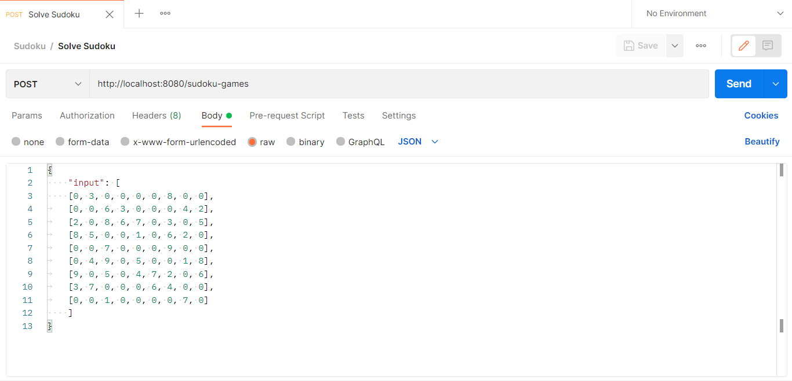

# This is an API for solving Sudoku Games

Developer by Doni Pebruwantoro
[](https://golang.org/)

# Table of Contents
- [Dependencies](#dependencies)
- [Tech Stacks](#tech-stacks)
- [Features](#features)
- [How to use](#how-to-use)

# Dependencies
- [Golang Echo Framework](https://github.com/labstack/echo) - The Restful API Library for Golang.
- [GoDotEnv](https://github.com/joho/godotenv) - Dependency for loading .env file.

# Technology Stacks
- [GoLang](https://golang.org/)
- [Postman](https://www.postman.com/)

# Features
- Solve Sudoku problems

# How to use this API

- For running this application, make sure that you have already installed [Golang](https://golang.org/), [Postman](https://www.postman.com/) in your local computer.

- Clone this repository

**Cloning from repository GitHub**
```sh
git clonehttps://github.com/pebruwantoro/API-Sudoku_Game.git
```

Default environment variable for my local computer. For setting environment variables, you are able to edit .env file.

Default HTTP PORT.For setting HTTP PORT, you can edit .env file.
```sh
HTTP_PORT=8080
```

- Testing API using Postman

**Testing API**
Open your Postman for testing this API.

1. Feature Solve Sudoku problems
Use method **POST** and this **ENDPOINT**
```sh
http://localhost:8080/sudoku-games
```

Example input:
```sh
{
    "input": [
    [0, 3, 0, 0, 0, 0, 8, 0, 0],
	[0, 0, 6, 3, 0, 0, 0, 4, 2],
	[2, 0, 8, 6, 7, 0, 3, 0, 5],
	[8, 5, 0, 0, 1, 0, 6, 2, 0],
	[0, 0, 7, 0, 0, 0, 9, 0, 0],
	[0, 4, 9, 0, 5, 0, 0, 1, 8],
	[9, 0, 5, 0, 4, 7, 2, 0, 6],
	[3, 7, 0, 0, 0, 6, 4, 0, 0],
	[0, 0, 1, 0, 0, 0, 0, 7, 0]
    ]
}
```


Example output:

